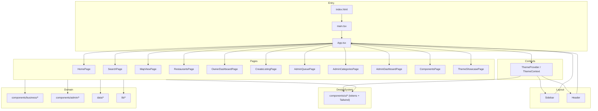

# App Architecture

Concise overview of the design system app’s runtime layers, navigation, data flow, and how the UI is structured.

## Overview

- Frontend: React 18 + TypeScript, bundled with Vite.
- Styling: Tailwind CSS + custom theme tokens (see `style.json` and design system docs).
- UI Primitives: `src/components/ui/*` provide token-driven building blocks.
- State & Navigation: Local React state in `App.tsx` (single-page navigation via `currentPage`).

## Key Modules & Structure

- `src/main.tsx`
  - React/Vite entry point; mounts the app into `index.html`.
- `src/App.tsx`
  - Application shell that wraps the tree in `ThemeProvider`, renders `Sidebar`, `Header`, and the active page.
  - Owns `currentPage` and `sidebarOpen` state.
- `src/contexts/ThemeContext.tsx`
  - Provides theme tokens and theme toggling to all components.
- `src/components/layout/*`
  - `Sidebar` – primary navigation; calls `onNavigate(pageKey)`.
  - `Header` – top bar with sidebar toggle and actions.
- `src/components/ui/*`
  - Design system primitives (buttons, cards, inputs, typography, badges, etc.), all styled via Tailwind + tokens.
- `src/components/business/*`
  - Business-directory specific components (listing cards, filters, etc.).
- `src/components/admin/*`
  - Admin dashboard widgets and panels.
- `src/pages/*`
  - Route-level pages and feature surfaces (see next section).
- `src/data/*`
  - Static/demo datasets for listings, metrics, and charts.
- `src/lib/*`
  - Shared utilities, helpers, and configuration logic.

## Pages & Navigation Flow

`App.tsx` renders a single-page shell and chooses the active page based on `currentPage`:

- `HomePage` – overall directory overview and entry points.
- `SearchPage` – search and filter experience over listings.
- `MapViewPage` – map-based exploration of businesses.
- `RestaurantsPage` – category-specific listing surface.
- `OwnerDashboardPage` – business owner dashboard.
- `CreateListingPage` – listing creation and editing flow.
- `AdminQueuePage` – admin moderation/review queue.
- `AdminCategoriesPage` – admin category management tools.
- `AdminDashboardPage` – admin analytics and status.
- `ComponentsPage` – design system component gallery.
- `ThemeShowcasePage` – theme and token showcase.

Navigation flow:

- `Sidebar` invokes `onNavigate(pageKey)` when a nav item is clicked.
- `App` updates `currentPage` and re-renders the corresponding page via a `switch`.
- `sidebarOpen` controls layout padding and a mobile overlay; `Header` toggles it.
- `ThemeProvider` wraps the shell so all pages and components can read theme context.

## Architecture Codemap

```text
src/
  main.tsx           # React + Vite entry
  App.tsx            # App shell, navigation state, ThemeProvider
  contexts/
    ThemeContext.tsx # Theme state and design tokens
  components/
    layout/          # Sidebar, Header, layout scaffolding
    ui/              # Design system primitives
    business/        # Business directory feature components
    admin/           # Admin dashboard feature components
  pages/             # Page-level feature surfaces
  data/              # Static/demo data for listings, charts, etc.
  lib/               # Utilities, helpers, configuration
```

## Mermaid Architecture Diagram

