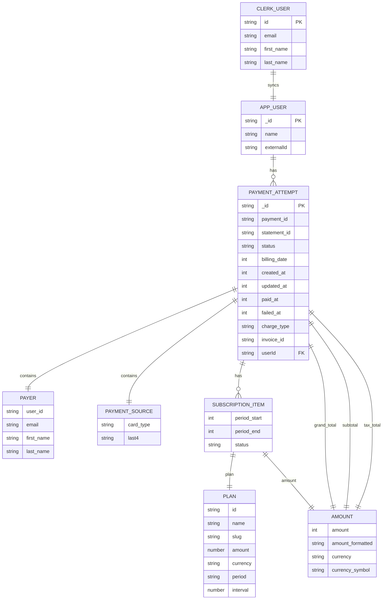

# Data Model

This document describes the core data entities, indexes, and relationships across the database (Convex), service layer (webhooks, queries/mutations), and relevant UI data.

## Entities

- User (Convex: users)
  - _id (PK)
  - name: string
  - externalId: string (UK) — maps to Clerk user id
  - Indexes: byExternalId(externalId)

- PaymentAttempt (Convex: paymentAttempts)
  - _id (PK)
  - payment_id: string (UK)
  - statement_id: string
  - status: string
  - billing_date, created_at, updated_at, paid_at?, failed_at?: number
  - charge_type: string
  - invoice_id: string
  - userId?: id(users) (FK → users._id)
  - payer: { email, first_name, last_name, user_id }
  - payment_source: { card_type, last4 }
  - subscription_items: [{ amount, plan, status, period_start, period_end }]
  - totals: { grand_total, subtotal, tax_total }
  - Indexes: byPaymentId(payment_id), byUserId(userId), byPayerUserId(payer.user_id)

- ClerkUser (external system)
  - id (PK)
  - email, first_name, last_name

## ERD

## Service Layer Mapping

- Webhook (POST /clerk-users-webhook)
  - user.created|updated → users.upsertFromClerk(data)
  - user.deleted → users.deleteFromClerk(clerkUserId)
  - paymentAttempt.updated → paymentAttempts.savePaymentAttempt(transformWebhookData(data))
- Linking rule: paymentAttempts.userId resolves from payer.user_id mapped to users.externalId.

## UI Data

- Public landing/pricing reads static pricing config (CustomClerkPricing).
- Payment-gated areas can query PaymentAttempt(s) by current user; Clerk session + middleware protect dashboard routes.
